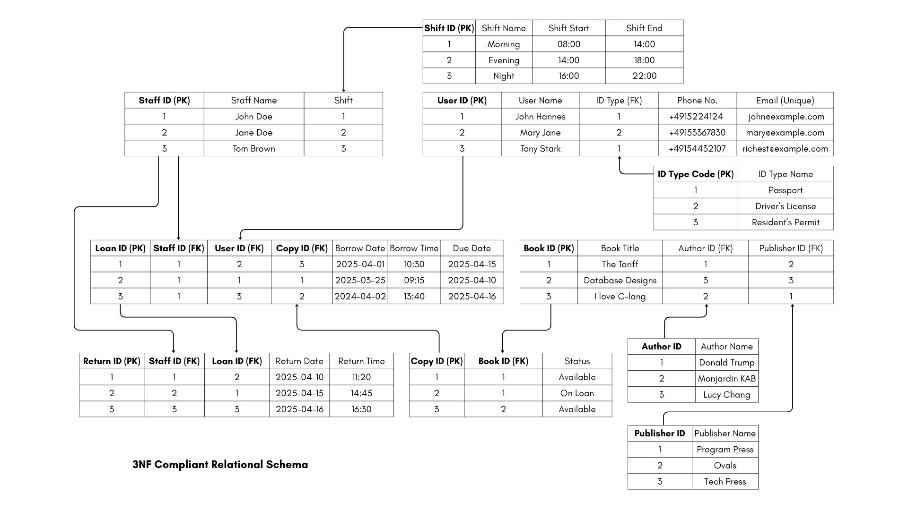

# Normalized Library
A query container for a normalized library database.
- Take a look at 1_final_db.png for a 3NF format of the database.


Made to fulfill Big Data & Analytics Course, Assignment 1

This project will:
- Build its own library database using the python file builder.
- Have a query sql file to house relevant business queries.

# Requirements
- This runs on python3.
- Ensure that you have a database already created with your psql user.
- Ensure that this database is named properly as the initial_database_name.

# Notes
Remember, you must first log in to your postgres user.

Like:
```
sudo -i -u postgres
```

To check if pgAdmin is installed properly use:
```
dpkg -l | grep pgadmin4
```

In case you forget your postgres password:
```
sudo -u postgres psql
ALTER USER postgres WITH PASSWORD 'enter_password';
\q
```

To install VS Code:
```
sudo snap install code --classic
```


made with Python and Postgresql, KB
